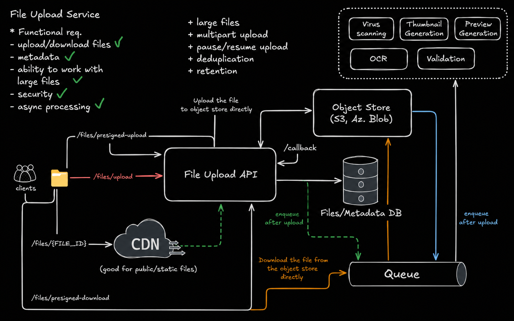

# File Upload Service



A production-oriented large-file upload and processing platform built as a
versioned backend engineering project.

The current v0.2 implementation runs locally with:

- Go 1.26 and Chi
- PostgreSQL 18
- SeaweedFS S3-compatible object storage
- NATS JetStream
- Docker Compose

## Start

Requirements:

- Go 1.26 or newer
- Docker Desktop with Compose

Start the complete platform and apply database migrations:

```bash
make services-up
```

Verify the API:

```bash
curl http://127.0.0.1:8080/health/live
curl http://127.0.0.1:8080/health/ready
```

Expected responses:

```json
{"status":"ok"}
```

```json
{"status":"ready"}
```

Stop the platform:

```bash
make db-down
```

The named Docker volumes remain available for the next start.

## Quality Checks

```bash
make check
make schema-check
docker compose config --quiet
docker build --tag file-upload-service:test .
```

`make check` runs formatting verification, `go vet`, tests, and the race
detector.

## Health Model

- Liveness reports whether the API process is serving HTTP.
- Readiness checks PostgreSQL, SeaweedFS, and NATS.
- A dependency outage keeps liveness healthy but changes readiness to HTTP 503.

## Upload Flow

File bytes never pass through the API. The client receives a short-lived
presigned PUT URL and uploads directly to SeaweedFS:

```bash
# Create an upload session
curl -X POST http://127.0.0.1:8080/v1/upload-sessions \
  -H "Authorization: Bearer <key>" \
  -H "Idempotency-Key: my-document-1" \
  -H "Content-Type: application/json" \
  -d '{"original_name":"report.pdf","content_type":"application/pdf","expected_size":204800}'

# Client PUT to the returned upload_url (direct to SeaweedFS, not the API)

# Confirm completion
curl -X POST http://127.0.0.1:8080/v1/files/<id>/complete \
  -H "Authorization: Bearer <key>"

# Get a download URL
curl http://127.0.0.1:8080/v1/files/<id>/download \
  -H "Authorization: Bearer <key>"
```

## API Endpoints

| Method | Path | Permission | Description |
| --- | --- | --- | --- |
| POST | /v1/upload-sessions | file:create | Create upload session and presigned PUT URL |
| POST | /v1/files/{id}/complete | file:create | Confirm upload, transition to ready |
| GET | /v1/files | file:read | List files with optional owner/status/cursor filters |
| POST | /v1/files/batch | file:read | Resolve up to 100 file IDs |
| GET | /v1/files/{id}/download | file:read | Get presigned download URL |
| DELETE | /v1/files/{id} | file:delete | Soft-delete a ready file |
| POST | /v1/keys | authenticated | Create API key for the current principal |
| DELETE | /v1/keys/{id} | authenticated | Revoke an API key |

## Authentication

API keys are stored as SHA-256 hashes only. The raw key is shown once at
creation. Each key resolves to a tenant-scoped principal with explicit
permissions. Revoked or expired keys are rejected immediately.

## Project Status

v0.2 Direct Upload And Download is complete. See [REPORT.md](REPORT.md) for
verified behavior and [roadmap.md](roadmap.md) for later versions.
